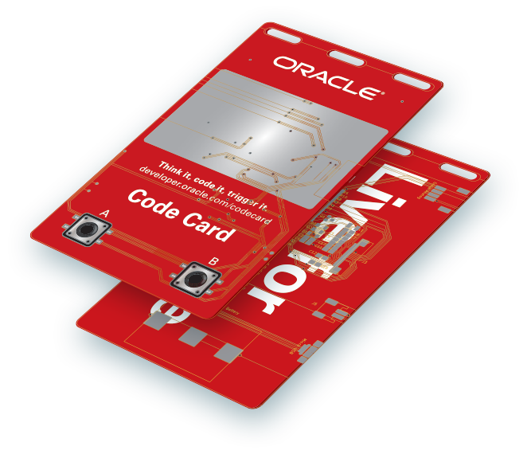

# The Code Card

Code Card is a Wi-Fi-enabled device with an e-paper display that can retrieve content from Oracle Cloud. Code Cards are available on a first-come basis to Oracle OpenWorld and Oracle Code One attendees who sign up for a cloud trial account. Stop by the Groundbreakers Hub to sign up and start configuring your Code Card.

There are loads of things that you can do with your Code Card - here's a list of documentation, work instructions, & code to get you up and running:

## Instructions
- **[Code Card Designer Mobile App](https://developer.oracle.com/codecard)**  
  Personalise the contents of your Code Card's display using the Code Card Designer Mobile Application.  
  Use the mobile app to create different template layouts, save them to the Oracle Cloud, and then retreive & apply them to your card's display with the press of a button. Ths is the quickest way to get up and running.  
  The Code Card mobile app is designed and built using the [Oracle Application Express (APEX)](https://apex.oracle.com/en/) low-code development platform.

  Click [this link](https://developer.oracle.com/codecard), and follow the 'No Code' instructions.

- **[Configuration Settings](/terminal/)**  
  Manage your Code Card configuration via serial connection over USB. Settings such as Wi-Fi SSID & Password can be managed via serial connection using the Code Cards integrated CLI.

  - **[Terminal Emulator](https://github.com/cameronsenese/codecard/blob/master/terminal/README.md#alternative-via-terminal-emulator)**  
    Manually configure your Code Card using a serial connection over USB. Initiate a serial connection using your favourite terminal emulation package (Putty, etc.) and configure your Code Card using the integrated CLI.

  - **[Code Card Configurator](/codecard-configurator)**  
    Python script to automatically configure Code Card settings using serial connection over USB. Useful for restting Code Card settings back to default, or to save and batch apply custom settings.  
    The Code Card Configurator uses the pyserial module to perform configuration updates.

    *Note: The Code Card Configurator is temporarily unavailable. Please see the [We're Moving](We're Moving!) section below.*

- **[Fn Functions (FaaS)](/functions/)**  
  Configure your Code Card to run Serverless Functions on Oracle Cloud Infrastructure using the Fn project FaaS platform. The Fn project is an open-source container-native serverless platform.

  - **[Name Badge Function](/functions/)**  
  Configure an Fn function to apply one of the default Code Card template layouts (with an associated icon, and custom text) to your Code Card e-paper display.

  - **[Node.js Weather Function](https://github.com/cameronsenese/codecard/tree/master/functions/examples/weather)**  
    Configure an Fn function to retrieve and display the weather forecast on the Code Card e-paper display.

    *Note: The Weather example is temporarily unavailable. Please see the [We're Moving](We're Moving!) section below.*

  - **[Custom Bitmap Function](https://github.com/cameronsenese/codecard/tree/master/functions/examples/bitmap)**  
  Configure an Fn function to download and apply a custom bitmap image to the Code Card e-paper display.

- **[Helidon (Java) Microservices on Kubernetes](/microservices/)**  
  Configure your Code Card to invoke a Java microservice running on Oracle Container Engine for Kubernetes (OKE). The Java microservice is built using the opensource [Helidon](https://helidon.io/#/) framework.

  *Note: The Microservices example is temporarily unavailable. Please see the [We're Moving](We're Moving!) section below.*

- **[Programming the Code Card Firmware](/arduino/)**  
  We have included the source code here so you can modify you Code Card however you want!  
  Instructions for setting up the Arduino IDE to program and upload your customisations to the Code Card Firmware.

  *Note: The Code Card firmware is temporarily unavailable. Please see the [We're Moving](We're Moving!) section below.*

## How did we build the Code Card?
We partnered with [Squarofumi](http://www.sqfmi.com/), creators of [Badgy](https://www.tindie.com/products/squarofumi/badgy-iot-badge/), an IoT badge, to create the Code Card.

## We're Moving!

Hey we're in the process of relocating this repository - details regarding Code Card's new home will be updated here shortly.

In the interim, some of the source code previously available here will be temporarily unavailable until the move is complete.

Apologies for any inconvenience.