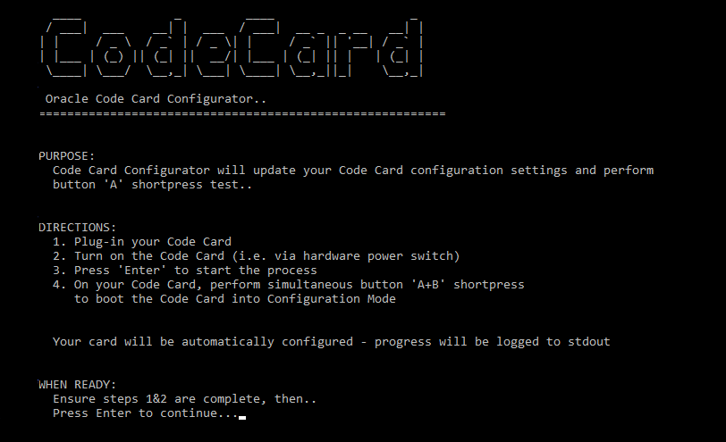

## Introduction

The Oracle Code Card Configurator is a command like utility used for managing configuration settings on Oracle Code Card devices.
The configurator provides a convenient method for quickly applying settings updates to Code Cards in a highly automated fashion.



*Code Card is a Wi-Fi-enabled device with an e-paper display that can retrieve content from Oracle Cloud.*
*Code Card Home: https://developer.oracle.com/codecard*

## Dependencies

Successful operation of the Code Card Configurator depends on the following dependencies being met on any host running the utility.

### Device Drivers

The Silicon Labs CP2104 USB to UART Bridge Controller is required to be installed in order to be able to establish a serial connection with the Code Card.
Windows, Mac, & Linux drivers are available here: https://www.silabs.com/products/development-tools/software/usb-to-uart-bridge-vcp-drivers

### Python

 - The configurator is written in Python, and specificlly requires Python 3.x to function.
 - `pyserial` & `art` modules should be installed.


From within a terminal session:

``` bash
  $ pip install pyserial
  $ pip install art

```

*Note: Code Card Configurator has been tested with Windows & MacOS..*

## Directions

Follow the below process to update your Code Card settings:

  1. Plug-in your Code Card using the provided USB connection
  2. Turn on the Code Card (i.e. via hardware power switch)
  3. Launch the code-card-configurator.py script in a terminal session
  4. Once prompted by the configurator - Press `Enter` to start the process
  5. Once the script is running: On your Code Card, perform simultaneous button 'A+B' shortpress
     to boot the Code Card into `Configuration Mode`.

  The script will detect when the card has completed booting into config mode and will automatically proceed to apply updated configuration settings.
  Once configuration settings have been applied, the card will automatically perform a button 'A' shortpress as a test.

  All progress will be logged to stdout.

#### Resources:

 - https://developer.oracle.com/codecard
