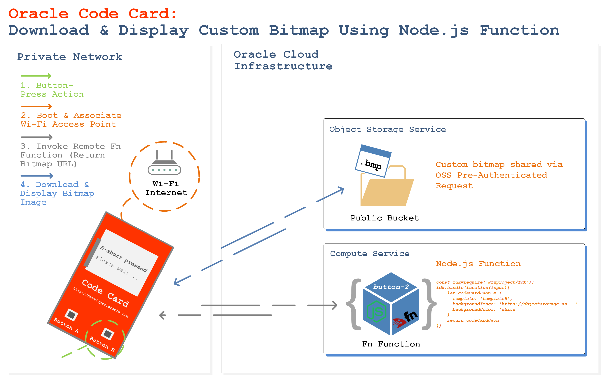
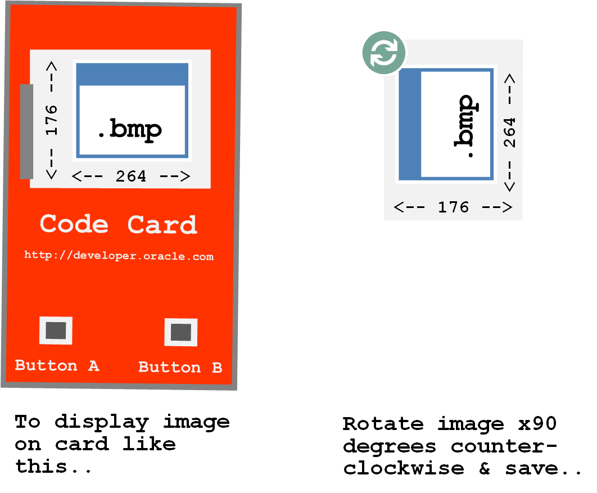

## Introduction

Your Code Card is able to download and display bitmap images on it's e-paper display.

In this guide we'll show you how to create an Fn function that, when invoked will instruct the Code Card to download a custom bitmap image and display it on the Code Card e-paper display.

The custom bitmap image will be hosted in an OCI Object Storage Service (OSS) bucket.

### Prerequisites

First, let's implement and configure the necessary components to create the custom Fn function.

You'll need an Oracle Linux compute instance running the Fn functions server in your OCI tenancy. Follow [this guide](https://github.com/cameronsenese/codecard/blob/master/functions/README.md), up to and including the step named *'Deploy your functions to your local Fn server'* before proceeding to implement the below configuration.

## Image Properties

The bitmap image properties should fall within the following guidelines:

- 176(h)x264(w) pixels (max)
- Bit-depth of 24bit (max)

In order for the image to display correctly on your Code Card, save the image with the orientation as rotated 90 degrees counter-clockwise:




## Upload custom .bmp to Object Storage Bucket

Sign-in to the OCI console and select a compartment from drop down menu on left part of the screen.

From the OCI Services menu,click **Object Storage** then **Create Bucket**.

Fill out the dialog box:

- Bucket Name: Provide a name (Bmp-Bucket in this lab)

- Storage Tier: STANDARD

Bucket detail window should be visible. Click **Upload Object**.

Click on Upload Object > Browse > This PC > Your Folder. You should see your custom bitmap file.

Select the file, then click **Upload Object** in the Dialog box.

File should be visible under Objects. Click Action icon and click **Create Pre- Authenticated Request**. This will create a web link that can be used to access the object Without requiring any additional authentication.

4. Fill out the dialog box:

  - NAME: Use an easy to remember name.
  - PRE AUTHENTICATION REQUEST TARGET: OBJECT
  - ACCESS TYPE: PERMIT READS ON THE OBJECT
  - EXPIRATION DATE/TIME: Specify link expiration date

Click **Create Pre-Authenticated Request**

Click **Copy** to copy the URL.

**NOTE:** The URL must be copied and saved - once the window is closed the link can not be retrieved again. This URL will be used later in the tutorial when configuring the Node.js Fn function.

## Create the Fn function
The Code Card needs to receive the following JSON format:

```bash
{
	"template": "template[1-11]",
	"title": "Hello World",
	"subtitle": "This is a subtitle",
	"bodtext": "This is the body",
	"icon": "[see list of named icons| BMP url]",
	"backgroundColor": "[white|black]"
}
```

In this tutorial we will be using template8, which requires only the following fields:

```bash
{
      template: 'template8',
      backgroundImage: 'https://url/image.bmp',
      backgroundColor: 'white'
}
```

To checkout all available templates go to Oracle Events App -> Code One --> Code Card Designer.

Let's create our Code Card function!

```bash
fn init --runtime node --trigger http button2
cd button2
​```bash

Now lets edit the func.js file using `nano` or `vi`.

​```bash
nano func.js
​```bash

Modify the handle function to look like this:

​```bash 
fdk.handle(function(input){
    let codeCardJson = {
      template: 'template8',
      backgroundImage: 'https://url/image.bmp',
      backgroundColor: 'white'
    }
    return codeCardJson
})
```

Replace the `backgroundImage` URL with the Object Storage Service Pre-Authenticated Request.

In nano `Ctrl` + O and `Ctrl` + X (WriteOut and Exit.)

In vi `ESC`  `:wq` (write and quit.)

Now deploy your new function

```bash
fn deploy --app codecard --local
```

And test on your browser

```bash
http://<linux-instance-public-ip>:8080/t/codecard/button2
```

Now you are ready to configure your Code Card to point to your new function!

### Configure Code Card
In this example, we will program the `shortpress` action for button `B` on the card.

#### Establish serial connection with Code Card
In order to configure our Code Card, we need to establish a serial connection over USB to the CodeCard CLI. Follow [this guide](https://github.com/cameronsenese/codecard/blob/master/terminal/README.md#connect-via-terminal-emulator) to establish the serial over USB connection. Remember to ensure that the Code Card WiFi settings are configured correctly also! (Direction available from the referenced guide).

#### Configure `buttonb1` button action
*In the Code Card CLI, `buttonb1` correlates to button B shortpress action.*

In your terminal session you should now see the Code Card CLI Menu, as follows.

```bash
***************************************************************************************
  Code Card v1.0
  Oracle Groundbreakers
  developer.oracle.com/codecard
***************************************************************************************
Commands:
  ls                Show all stored key/values
  help              Show this help
  shortpress[a|b]   Simulate the press of a button
  longpress[a|b]    Simulate the long press of a button
  connect           Connect to wifi
  disconnect        Disconnect wifi
  restart           Restart wifi
  status            Show wifi status
  home              Show home screen
  reset             Reset to factory settings

Usage:
  Read saved key value:
    key
  Save new key value:
    key=[value]

Available keys:
  ssid, password, buttona1, buttona2, buttonb1, buttonb2, fingerprinta1, fingerprinta2,
  fingerprintb1, fingerprintb2, methoda1, methoda2, methodb1, methodb2,
>>>
```

First, we will set the HTTP method for the B shortpress by entering the following command.
*Keep in mind that pausing for 2 seconds while typing will automatically enter the command. It may be easier to pre-type the commands elsewhere and copy-paste them into the window.*

```bash
methodb1=GET
```

Code Card will confirm setting update as follows.
```bash
>>>
Value saved for methodb1: GET
>>>
```

Next configure the HTTP endpoint for the B shortpress by entering the following command. Be sure to substitute values in `<brackets>` as appropriate.

```bash
buttonb1=http://<linux-instance-public-ip>:8080/t/codecard/button2
```

Code Card will confirm setting update as follows.

```bash
>>>
Value saved for buttonb1: http://<linux-instance-public-ip>:8080/t/codecard/button2
>>>
```

### Invoke the function from the Code Card
Ok, so now our cloud function and Code Card are ready to Go! Powercycle your Code Card and perform a button B shortpress. If your card is still connected via the serial connection, you will see output similar to the following & your custom bitmap will be displayed on your Code Cards e-paper display.

```bash
Button b - short pressed
>>>
Connecting to 'pmac851' ..connected!
IP address: 192.168.43.87
MAC address: CC:50:E3:C5:70:D1
>>>
Request:
  host: 132.145.133.201
  port: 8080
  url: http://132.145.133.201:8080/t/codecard/button2
  method: GET
application/json

Response: 
  {"template":"template8","backgroundImage":"https://objectstorage.us-ashburn-1.oraclecloud.com/p/123/n/oci/b/codecard/o/customImage.bmp","backgroundColor":"white"}
>>>
Request:
  host: objectstorage.us-ashburn-1.oraclecloud.com
  port: 443
  url: https://objectstorage.us-ashburn 1.oraclecloud.com/p/123/n/oci/b/codecard/o/customImage.bmp
  fingerprint: 
  method: GET
Response:
  HTTP/1.1 200 OK

  File size: 139446
  Image Offset: 54
  Header size: 40
  Bit Depth: 24
  Image size: 176x264
  waited for available 1626 ms
  waited for available 1110 ms
  waited for available 1625 ms
  waited for available 1466 ms
  waited for available 1626 ms
  waited for available 557 ms
  waited for available 1626 ms
  waited for available 1114 ms
  waited for available 1625 ms
  waited for available 1109 ms
  waited for available 1626 ms
  waited for available 812 ms
  waited for available 1626 ms
  waited for available 1111 ms
  waited for available 1626 ms
  waited for available 1110 ms
  waited for available 1626 ms
  waited for available 1109 ms
  waited for available 1626 ms
  waited for available 809 ms
  waited for available 1626 ms
  waited for available 1110 ms
  waited for available 1626 ms
  waited for available 1112 ms
  waited for available 1626 ms
  waited for available 809 ms
  waited for available 1625 ms
  waited for available 1112 ms
  waited for available 1626 ms
  waited for available 1110 ms
  waited for available 1626 ms
  waited for available 1109 ms
  waited for available 1626 ms
  waited for available 1104 ms
  downloaded in 46762 ms
  bytes read 139446
Shuting down...
>>>
```
