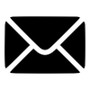
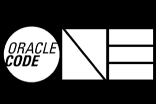

# Code Card Icons
You can use any of the pre-configured name icons or you can upload your own.

| Name | Image |
|----------|----------|
|  01d  |   |
|  02d  |   |
|  03d  |   |
|  04d  |   |
|  09d  |   |
|  10d  |   |
|  11d  |   |
|  13d  |   |
|  50d  |   |
|  ace  |   |
|  blockchain  |   |
|  champion  |   |
|  chatbots  |   |
|  db  |   |
|  duke  |   |
|  fail  |   |
|  java  |   |
|  javascript  |   |
|  jduchess  |   |
|  mail  |   |
|  microservices  |   |
|  nighthacker  |   |
|  opensource  |   |
|  twitter  |   |

### Backgrounds
| Name | Image |
|----------|----------|
|  codeone  |   |
|  oracle  |   |