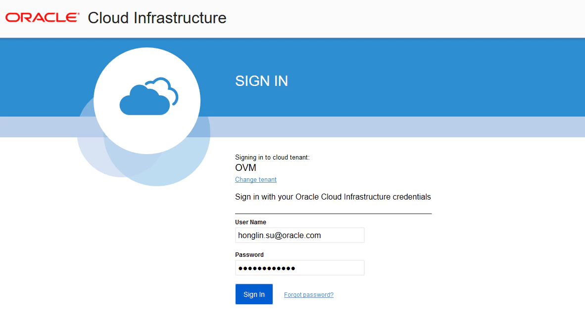
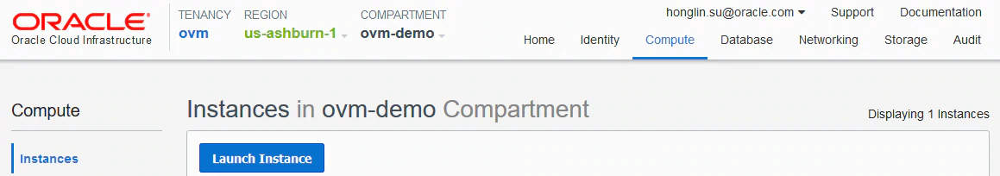
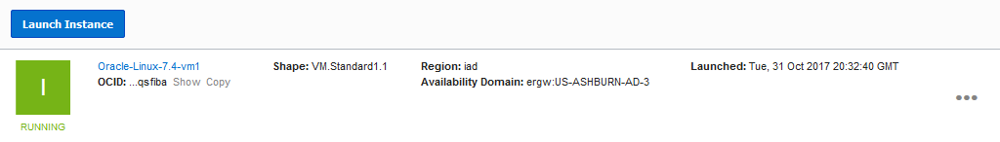

## Task flow overview to launch your Oracle Linux instance

First we follow these steps to launch your Oracle Linux instance:

 - Prepare a key pair
 - Choose a compartment for your resources
 - Prepare a Virtual Cloud Network
 - Launch an Oracle Linux instance
 - Connect to the Oracle Linux instance


### Prepare a key pair

Instances in Oracle Cloud Infrastructure use a Secure Shell (SSH) key pair instead of a password to authenticate a remote user. If you have already had an SSH-2 RSA key pair, you can use it to access Oracle Cloud Infrastructure.

If you don't have an SSH-2 RSA key pair, you can use the ssh-keygen command to generate the key pair from an Oracle Linux instance or any other Linux/UNIX environment. Or if you are using Microsoft Windows client, you can use PuTTY key generator.

You use the ssh-keygen command and follow the interactive prompt to generate the key pair.

```
$ ssh-keygen
Generating public/private rsa key pair.
Enter file in which to save the key (/home/honsu/.ssh/id_rsa):
Enter passphrase (empty for no passphrase):
Enter same passphrase again:
Your identification has been saved in /home/honsu/.ssh/id_rsa.
Your public key has been saved in /home/honsu/.ssh/id_rsa.pub.
```

### Choose a compartment for your resources

Log into the Oracle Cloud Infrastructure console.



Oracle Cloud Infrastructure uses the term compartment to describe a collection of related resources (such as cloud networks, compute instances, or block volumes) that you organize and manage within your account. The root compartment is the top level compartment within your account, which is created automatically when your account is provisioned by Oracle Cloud Infrastructure.
In the example below the root compartment is `ovm`.


If you don't already have a compartment, create one to start organizing your computing resources. In the example below, the ovm-demo compartment is been created.


### Prepare a Virtual Cloud Network

Next you need to create a virtual cloud network (VCN) to launch the Oracle Linux instance into. In the example below, we choose the option "CREATE VIRTUAL CLOUD NETWORK PLUS RELATED RESOURCES" with the default values when creating a VCN `ovm-network` which is placed within the compartment `ovm-demo`.


### Create network Ingress Rule

Next you need to create a network Ingress Rule to to allow inbound requests from the public internet to reach your Fn server. In the example below, we add a stateful ingress rule to the Default Security List for our `ovm-network` VCN. Specify the source CIDR as `0.0.0.0/0`, the protocol as `TCP`, & the destination port range as `8080`.


### Launch an Oracle Linux instance

Now you are ready to launch an Oracle Linux instance.



The example below creates an Oracle Linux instance using the shape VM.Standard2.1 based on an Oracle Linux 7.5 OS. You need to use the ssh key file you created earlier.


After you click "Launch Instance", the Oracle Linux 7.4 instance is being provisioned.


After a few seconds, the status is changed from "PROVISIONING" to "running".



You now click the instance name "Oracle-Linux-7.4-vm1" to see the details of the instance and write down the public IP address which you'll use to connect to the instance in the next step.


### Connect to your Oracle Linux instance

Now you can connect to the newly provisioned Oracle Linux instance by using an SSH client to access its public IP address.

```
ssh -i ~/.ssh/mykey opc@129.213.18.44
ssh –i <private_key> <username>@<public-ip-address>
```

_When you’re logged in as the default user `opc`, you can use the sudo command to run administrative tasks._

###	Next Steps
Go back to the [main guide](README.md) to continue your setup.