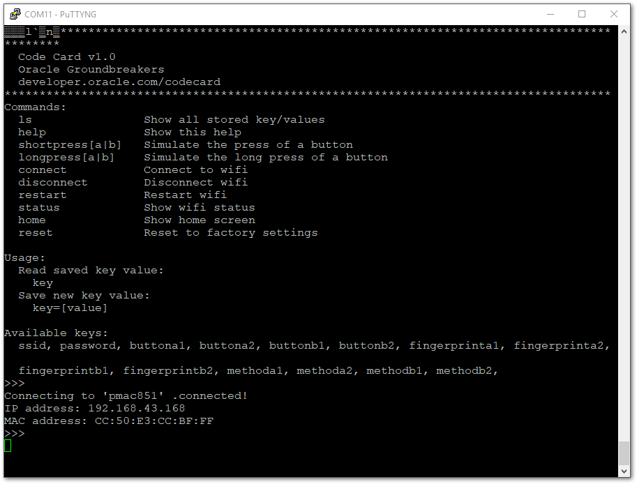

# Code Card CLI


To make it easier to configure your Code Card, we included an embedded CLI.  
The Code Card has a serial-usb chip. We use serial communication to configure the Code Card wifi and button settings.

### Connect via Terminal Emulator
You can also use any terminal emulator app such as [PuTTY](https://www.putty.org/) (Windows), [CoolTerm](http://freeware.the-meiers.org/CoolTermMac.zip) (Mac), or [screen](https://linux.die.net/man/1/screen) (Mac and Linux.)

The USB-Serial port will have different names depending on your OS:
-	Windows: COM[X]
-	Mac: /dev/tty.wchusbserial[XXXX]
-	Linux: /dev/ttyUSB[X]

_If your machine is not recognizing the Code Card, you might need to install the [the Silicon Labs CP2104 USB serial drivers](https://www.silabs.com/products/development-tools/software/usb-to-uart-bridge-vcp-drivers). You will need to reboot your system before the drivers will function correctly._

##### Steps

1. Connect to the device with the emulator for your OS (baud rate = 115200)
2. Once connected, you'll need to reset the device by flipping the power switch off then on again
3. Bring the Code Card into configuration mode by performing a simultaneous button A+B short-press

Once the Code Card has finished booting into configuration mode - the CLI menu will be displayed (per the above image).  
You can type `help` in the emulator anytime to bring up a list of commands..

Keep in mind that pausing for 2 seconds while typing will automatically enter the command. It may be easier to pre-type the commands elsewhere and copy-paste them into the window.

##### Change Wi-Fi Profile:

First, we will set the Wi-Fi SSID by entering the following command.
```bash
ssid=<your-ssid>
```

Code Card will confirm setting update as follows.
```bash
>>>
Value saved for ssid: <your-ssid>
>>>
```

Next, set the Wi-Fi password by entering the following command.
```bash
password=<your-password>
```

Code Card will confirm setting update as follows.
```bash
>>>
Value saved for password: <your-password>
>>>
```
